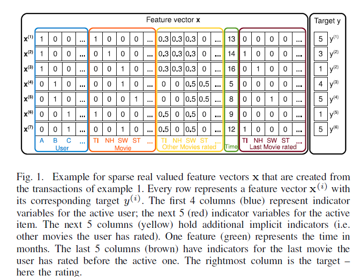
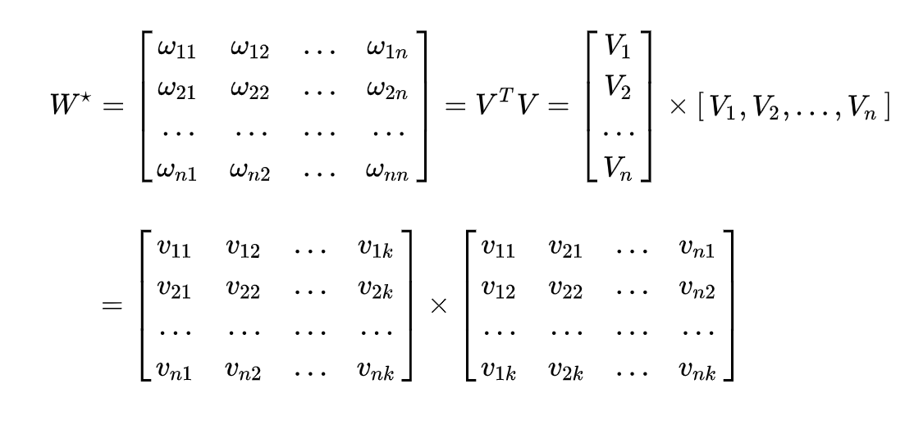

# FM算法

**FM（Factorization Machine，因子分解机）** 算法是一种基于矩阵分解的机器学习算法，是为了解决大规模稀疏矩阵中特征组合问题。

特征中的前四列表示:

1. 用户$u$($one-hot$编码，稀疏)                      


2. 五列表示电影$i$($ont-hot$编码，稀疏）                  


3. 五列表示用户u对电影i的打分（归一化特征）               


4. 紧接着一列表示时间（连续特征）                 

 
5. 最后五列表示用户$u$对电影$i$打分前评价过的最近一部电影($one-hot$编码，稀疏)                  




## FM算法模型
    
二元交叉的FM——(2-way FM)目标函数如下：

其中，$x_i$是样本第$i$个特征, $w$是输入特征的参数，$<vi,vj>$是输入特征$i,j$间的交叉参数，$v$是$k$维向量。

前面两个就是线性模型，后面一个就是需要学习的**交叉组合特征**，正是$FM$区别与线性模型的地方。

$$\hat y(x) := w_0 + \sum^n_{i=1}w_ix_i + \sum^n_{i=1}\sum^n_{j=i + 1}<v_i, v_j>x_ix_j$$

$$V \in R ^ {n \times k}$$

$$<v_i,v_j>:= \sum^k_{f=1}v_{i,f} \cdot v_{j,f}$$

组合部分假如使用单一参数$\omega_{i,j}$，那么特征相关参数共有$\frac{n(n-1)}{2}$个。但是如第二部分所分析，在数据很稀疏的情况下，**满足$x_i,x_j$都不为$0$的情况非常少，这样将导致$\omega_{i,j}$无法通过训练得出**。

为了求出$\omega_{i,j}$，对每一个特征分量$x_i$引入辅助向量$V_i=(v_{i,1},\ v_{i,2}\ ,\cdots,v_{i,k})$(相当于每个特征类别的一个embedding)。然后，利用$v_i\cdot v_j^T$对$\omega_{i,j}$进行求解。




## 模型简化

$$\begin{aligned}
\sum_{i=1}^{n-1}\sum_{j = i+1}^n<v_i,v_j>x_ix_j &= \frac{1}{2}\sum_{i=1}^{n}\sum_{j = 1}^n<v_i,v_j>x_ix_j - \frac{1}{2}\sum_{i=1}^n<v_i,v_i>x_ix_i\\
&=\frac{1}{2}(\sum_{i=1}^{n}\sum_{j = 1}^n\sum_{f=1}^k v_{i,f}\ v_{j,f}\ x_ix_j - \sum_{i=1}^n\sum_{f=1}^k v_{i,f}^2\ x_i^2)\\
&=\frac{1}{2}\sum_{f=1}^k\Bigg[(\sum_{i=1}^nv_{i,f}\ x_i)\cdot(\sum_{j=1}^nv_{j,f}\ x_j) - \sum_{i=1}^nv_{i,f}^2\ x_i^2\Bigg]\\
&=\frac{1}{2}\sum_{f=1}^k\Bigg[(\sum_{i=1}^nv_{i,f}\ x_i)^2 - \sum_{i=1}^nv_{i,f}^2\ x_i^2\Bigg]
\end{aligned}$$

第二个等号到第三个等号的理解见以下代码:

`(a + b + c) ** 2 = a**2 + b**2 + c**2 + ab + ac +bc `
```python
import numpy as np

a = [1,2,3]
b = [1,2,3]

np.sum(a) * np.sum(b) == (np.array(a).reshape(-1,1) * np.array(b).reshape(1,-1)).sum()

# True
```


## 优化方法     

对权重求导得到如下结果:

$$\cfrac{\partial y}{\partial \theta} = \begin{cases}
1,&if\ \theta \ is \ \omega_0\\
x_i, & if\ \theta \ is \omega_i\\
x_i\sum_{j=1}^nv_{j,f}\ x_j - v_{i,f} \ x_i^2 , & if \ \theta \ is \ v_{i,f}
\end{cases}$$


由上式可知，$v_{i,f}$的训练只需要样本的 $x_i$ 特征非0即可，适合于稀疏数据


在使用`SGD`训练模型时，在每次迭代中，只需计算一次所有$f$ 的$\sum_{j=1}^nv_{j,f}\ x_j$

实际上从辅助向量的梯度中看到，对于$v_{i,j}$的梯度中求和的部分与$i$无关，对所有特征维度只需要计算一次求和


# FFM

FFM(Field-aware Factorization Machine),引入field的概念，FFM把相同性质的特征归于同一个field。

一个category特征就是一个field——日期列、品牌列等等。

简单来说，同一个categorical特征经过One-Hot编码生成的数值特征都可以放到同一个field，包括用户性别、职业、品类偏好等。

在FFM中，每一维特征$x_i$，针对其它特征的每一种field$f_j$，都会学习一个隐向量$v_{i,f_j}$